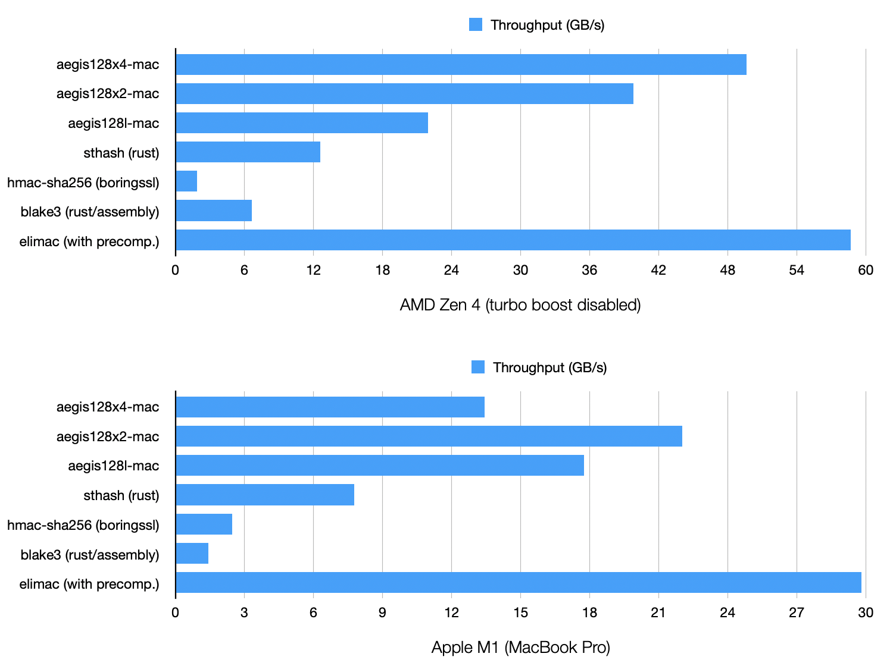

# EliMAC

[EliMAC](https://tosc.iacr.org/index.php/ToSC/article/view/10979/10412) is a ridiculously fast AES-based Message Authentication Code.

It was designed by Christoph Dobraunig, Bart Mennink and Samuel Neves, and was presented at FSE 2024.

This is an experimental implementation for x86_64 and ARM64 CPUs with AES extensions, leveraging precomputation.

Untested, do not use for anything serious.

## Benchmarks

